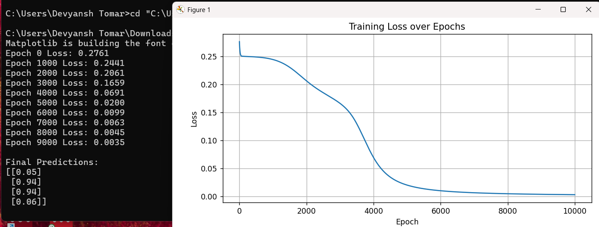

# Neural Network from Scratch using NumPy

This project demonstrates a neural network that solves the XOR problem using just Python and NumPy.

## 🚀 What It Does
- Builds a 2-layer neural network
- Solves XOR (non-linear problem)
- Uses sigmoid activation, forward & backpropagation, and gradient descent

## 🧠 Key Concepts
- Feedforward Neural Networks
- Sigmoid activation
- Mean Squared Error Loss
- Backpropagation
- Gradient Descent

---

## ⚙️ How to Set Up

### 📥 Install Python Libraries

Make sure you have Python 3 and install required packages:

- bash
- python3
- pip install numpy matplotlib

## 🔧Working Procedure

### 📥 Input & Target
The model receives 4 binary input pairs and expected XOR outputs:

Input	Expected Output
 [0, 0]	0
 [0, 1]	1
 [1, 0]	1
 [1, 1]	0

### 🧠 What the Network Does
Initializes random weights and biases

- Applies forward propagation using sigmoid activation

- Calculates loss using Mean Squared Error (MSE)

- Backpropagates errors to update weights

- Repeats the process over 10,000 training epochs

## 📉 Learning Process
During training:

The loss starts high (~0.27)

Gradually decreases

Reaches < 0.01 by the end — showing the network has learned

## 📊 Output Graph: Training Loss Curve
The graph below shows the loss steadily decreasing over epochs — confirming that the model is successfully learning the XOR mapping.

🔹 Loss starts at ~0.27

🔹 Sharp drop between 3,000–6,000 epochs

🔹 Final loss is < 0.01

📌 This pattern shows excellent convergence for a non-linearly separable classification task.
  

## ✅ Final Predictions

 Input: [0, 0] → Output: ~0.05
 Input: [0, 1] → Output: ~0.94
 Input: [1, 0] → Output: ~0.94
 Input: [1, 1] → Output: ~0.06
 📌 These predictions are very close to the true XOR outputs — showing that the neural network learned the logic correctly.

